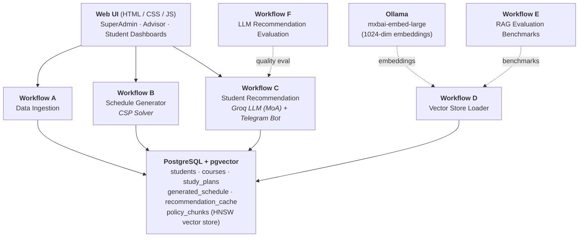

# 🎓 N8N Course Management System

> AI-powered university course scheduling and student recommendation system for **Alamein University — Faculty of Computer Science & Engineering**, built on [n8n](https://n8n.io/) workflow automation.

---

## 📋 Table of Contents

- [Overview](#overview)
- [Architecture](#architecture)
- [Technology Stack](#technology-stack)
- [Prerequisites](#prerequisites)
- [Installation Guide](#installation-guide)
  - [Step 1 — n8n Instance Setup](#step-1--n8n-instance-setup)
  - [Step 1.5 — Expose n8n via Cloudflare Tunnel (Telegram Bot)](#step-15--expose-n8n-via-cloudflare-tunnel-required-for-telegram-bot)
  - [Step 2 — PostgreSQL & pgvector Setup](#step-2--postgresql--pgvector-setup)
  - [Step 3 — Apply the Database Schema](#step-3--apply-the-database-schema)
  - [Step 4 — Ollama Installation & Embedding Model](#step-4--ollama-installation--embedding-model)
  - [Step 5 — Import n8n Workflows](#step-5--import-n8n-workflows)
  - [Step 6 — Mount Policy Files for RAG](#step-6--mount-policy-files-for-rag)
  - [Step 7 — Configure Credentials in n8n](#step-7--configure-credentials-in-n8n)
  - [Step 8 — Ingest Academic Data](#step-8--ingest-academic-data)
  - [Step 9 — Launch the Web UI](#step-9--launch-the-web-ui)
- [Project Structure](#project-structure)
- [Workflows Overview](#workflows-overview)
- [Web UI — User Roles](#web-ui--user-roles)
- [Ingestion Data Format](#ingestion-data-format)
- [Troubleshooting](#troubleshooting)

---

## Overview

This system automates three core university operations through a suite of interconnected n8n workflows and a web-based dashboard:

1. **Data Ingestion** — Bulk upload of student grades, study plans, prerequisites, electives, rooms, and constraints from Excel/CSV files.
2. **Schedule Generation** — A Constraint Satisfaction Problem (CSP) greedy solver that produces conflict-free course timetables with advisor approval workflow.
3. **AI Student Advising** — A multi-agent AI pipeline (Mixture of Agents) that recommends personalized course selections based on academic history, GPA constraints, and career goals, plus a RAG-powered policy Q&A chatbot.

Additionally, evaluation workflows benchmark the quality of the RAG retrieval system and the LLM recommendation engine.

---

## Architecture



---

## Technology Stack

| Component           | Technology                                          |
| ------------------- | --------------------------------------------------- |
| Automation Engine   | **n8n** (self-hosted)                               |
| Database            | **PostgreSQL 15+** with `pgvector` extension        |
| Vector Index        | HNSW (m=16, ef_construction=64), cosine distance    |
| Embeddings          | **Ollama** — `mxbai-embed-large` (1024 dimensions)  |
| LLM Inference       | **Groq Cloud** — `llama-3.3-70b-versatile`          |
| LLM Evaluation      | **Groq Cloud** — `llama-4-scout-17b-16e-instruct`   |
| Messaging           | **Telegram Bot API**                                |
| Web UI              | Vanilla **HTML / CSS / JavaScript**                 |
| Dev Server          | **Node.js** (lightweight static server)             |

---

## Prerequisites

Before you begin, ensure you have the following installed on your machine:

| Requirement        | Minimum Version | Notes                                      |
| ------------------ | --------------- | ------------------------------------------ |
| Docker & Docker Compose | Latest     | For running n8n, PostgreSQL, and Ollama    |
| Node.js            | 18+             | For running the UI dev server              |
| Git                | Any             | To clone the repository                    |
| Groq API Key       | —               | Free tier available at https://console.groq.com |
| DeepSeek API Key   | —               | From https://platform.deepseek.com         |
| Telegram Bot Token | —               | Created via [@BotFather](https://t.me/BotFather) on Telegram |

---

## Installation Guide

### Step 1 — n8n Instance Setup

Set up a self-hosted n8n instance. The recommended approach is Docker:

```bash
docker run -d \
  --name n8n \
  --restart unless-stopped \
  -p 5678:5678 \
  -v n8n_data:/home/node/.n8n \
  -v /path/to/your/local/files:/home/node/.n8n-files \
  n8nio/n8n
```

> **Important:** The `-v /path/to/your/local/files:/home/node/.n8n-files` mount is critical — it allows n8n to access local files, which is required for the RAG policy document loading (Workflow D). Replace `/path/to/your/local/files` with an actual directory on your host machine containing the policy files.

Once running, access n8n at: **http://localhost:5678**

Complete the initial setup (create your admin account).

---

### Step 1.5 — Expose n8n via Cloudflare Tunnel (Required for Telegram Bot)

The Telegram Bot (Workflow C) requires a **publicly accessible HTTPS URL** to receive webhook callbacks from Telegram. A Cloudflare tunnel provides this without opening ports on your firewall.

Save the following script as `start-n8n.sh` in your project root and make it executable (`chmod +x start-n8n.sh`):

```bash
#!/bin/bash

# =========================================================
# 1. Setup Cleanup & Helper Functions
# =========================================================
# Stops the background tunnel when you exit n8n
cleanup() {
    echo -e "\nShutting down containers..."
    sudo docker stop n8n-tunnel >/dev/null 2>&1
    echo "Cloudflare tunnel stopped. Goodbye!"
}
trap cleanup EXIT

# Cross-platform function to open the browser
open_browser() {
    local url=$1
    if command -v xdg-open > /dev/null; then
        xdg-open "$url"     # Linux
    elif command -v open > /dev/null; then
        open "$url"         # macOS
    elif command -v start > /dev/null; then
        start "$url"        # Windows (Git Bash/WSL)
    else
        echo "Could not detect web browser. Please open $url manually."
    fi
}

# Clean up any leftover containers from previous sessions
sudo docker stop n8n-tunnel n8n >/dev/null 2>&1

# =========================================================
# 2. Start Cloudflare Tunnel (Background)
# =========================================================
echo "Starting Cloudflare tunnel in the background..."
sudo docker run -d --rm --name n8n-tunnel \
  --network host \
  cloudflare/cloudflared:latest tunnel --url http://localhost:5678 >/dev/null 2>&1

# =========================================================
# 3. Extract the TryCloudflare URL
# =========================================================
echo "Waiting for the Cloudflare URL to be generated..."
WEBHOOK_URL=""
ATTEMPTS=0
MAX_ATTEMPTS=15

while [ -z "$WEBHOOK_URL" ]; do
    if [ $ATTEMPTS -eq $MAX_ATTEMPTS ]; then
        echo "Error: Could not fetch the Cloudflare URL. Please check your internet connection or docker logs."
        exit 1
    fi
    sleep 2
    
    # Extract the https://*.trycloudflare.com URL from the tunnel logs
    WEBHOOK_URL=$(sudo docker logs n8n-tunnel 2>&1 | grep -o 'https://[a-zA-Z0-9-]*\.trycloudflare\.com' | head -n 1)
    ATTEMPTS=$((ATTEMPTS+1))
done

echo "--------------------------------------------------------"
echo "✅ Cloudflare Tunnel Active!"
echo "🔗 Webhook URL: $WEBHOOK_URL"
echo "--------------------------------------------------------"

# =========================================================
# 4. Open Browser (Delayed) & Start n8n
# =========================================================
echo "Starting n8n... (Browser will open automatically in 8 seconds)"

# Start a background timer to open the URL once n8n is likely ready
(sleep 8 && open_browser "$WEBHOOK_URL") &

# Start n8n in the foreground
sudo docker run -it --rm \
  --add-host=host.docker.internal:host-gateway \
  --name n8n \
  -p 5678:5678 \
  -v ~/.n8n:/home/node/.n8n \
  -v ~/.n8n-files:/home/node/.n8n-files \
  -e WEBHOOK_URL="$WEBHOOK_URL" \
  -e N8N_BLOCK_ENV_ACCESS_IN_NODE=false \
  -e N8N_LOG_LEVEL=debug \
  n8nio/n8n
```

**How it works:**

1. `cloudflared` creates a temporary public `https://<random>.trycloudflare.com` URL that tunnels to `localhost:5678`
2. The script extracts this URL from the tunnel logs
3. The URL is passed to n8n via the `WEBHOOK_URL` environment variable
4. n8n uses this as its public-facing URL for webhook registrations (including Telegram)
5. When you stop n8n (Ctrl+C), the tunnel container is automatically cleaned up

> **Note:** The `trycloudflare.com` URL changes every time you restart the script. Telegram re-registers the webhook automatically on n8n startup.

Use this script instead of the plain `docker run` command from Step 1 whenever you need the Telegram Bot to function.

---

### Step 2 — PostgreSQL & pgvector Setup

#### Option A: Docker (Recommended)

```bash
docker run -d \
  --name postgres \
  --restart unless-stopped \
  -p 5432:5432 \
  -e POSTGRES_USER=your_username \
  -e POSTGRES_PASSWORD=your_password \
  -e POSTGRES_DB=your_database_name \
  postgres:18
```

#### Install the pgvector Extension

The default PostgreSQL Docker image does **not** include `pgvector`. You must install it manually inside the container:

**1. Access the container as root:**

```bash
docker exec -it -u root postgres bash
```

**2. Install pgvector:**

```bash
apt-get update
apt-get install -y postgresql-18-pgvector
```

**3. Exit the container:**

```bash
exit
```

#### Option B: Native PostgreSQL (No Docker)

If running PostgreSQL directly on your machine, install `pgvector` using your system's package manager, then enable the extension:

```sql
CREATE EXTENSION IF NOT EXISTS vector;
```

---

### Step 3 — Apply the Database Schema

The database schema file is located at `Database Schema/schema.sql`. It creates all 12 required tables including the pgvector extension setup.

#### Docker Method

Pipe the schema file directly into the container's `psql` instance:

```bash
cat "Database Schema/schema.sql" | docker exec -i postgres psql -U your_username -d your_database_name
```

#### Standard Local Method

If you are running PostgreSQL directly, or if you have a shell open inside your Docker container:

```bash
psql -U your_username -d your_database_name -f /path/to/schema.sql
```

#### Verify Installation

Connect to your database and confirm the tables were created:

```bash
docker exec -it postgres psql -U your_username -d your_database_name -c "\dt"
```

You should see these tables:

| Table                  | Purpose                                    |
| ---------------------- | ------------------------------------------ |
| `programs`             | Program codes (AIE, AIS, CE, CS)           |
| `courses`              | Course catalog                             |
| `students`             | Student profiles and GPA                   |
| `student_grades`       | Historical course grades                   |
| `study_plan_entries`   | Program curriculum per semester            |
| `prerequisites`        | Course prerequisite rules                  |
| `elective_groups`      | Elective offerings by program              |
| `rooms`                | Room inventory (halls and labs)            |
| `constraints`          | Academic rules (credit limits, thresholds) |
| `generated_schedule`   | Course timetable output                    |
| `recommendation_cache` | Cached AI recommendations (24h TTL)       |
| `policy_chunks`        | Vectorized policy documents for RAG        |

---

### Step 4 — Ollama Installation & Embedding Model

Ollama is required for generating text embeddings used by the RAG policy Q&A system.

#### Install Ollama

```bash
curl -fsSL https://ollama.com/install.sh | sh
```

Or run Ollama as a Docker container:

```bash
docker run -d \
  --name ollama \
  --restart unless-stopped \
  -p 11434:11434 \
  -v ollama_data:/root/.ollama \
  ollama/ollama
```

#### Pull the Embedding Model

```bash
ollama pull mxbai-embed-large:latest
```

> This model produces **1024-dimensional** vectors and is used by Workflow D (Vector Store Loader) and Workflow C (Student Recommendation — RAG pipeline).

Verify the model is available:

```bash
ollama list
```

You should see `mxbai-embed-large:latest` in the output.

---

### Step 5 — Import n8n Workflows

There are **6 workflows** in the `workflows/` directory that must be imported into your n8n instance:

| File                                           | Workflow                         |
| ---------------------------------------------- | -------------------------------- |
| `Project_ A_ Data Ingestion.json`              | Data Ingestion (SuperAdmin)      |
| `Project_ B_ Schedule Generator.json`          | Schedule Generator (Advisor)     |
| `Project_ C_ Student Recommendation.json`      | Student Recommendation (AI)      |
| `Project D_ Vector Store Loader.json`          | Vector Store Loader (RAG)        |
| `Project_ E_ RAG Evaluation Benchmarks.json`   | RAG Evaluation Benchmarks        |
| `Project_ F_ LLM Recommendation Evaluation.json` | LLM Recommendation Evaluation |

#### How to Import

1. Open your n8n instance in the browser (http://localhost:5678)
2. For **each** workflow JSON file:
   - Click **"Add workflow"** (or the `+` button)
   - Click the **three dots menu (⋯)** → **"Import from File…"**
   - Select the corresponding `.json` file from the `workflows/` directory
   - Save the workflow
3. Repeat for all 6 workflow files

> **Note:** Do **not** activate workflows until all credentials are configured (Step 7).

---

### Step 6 — Mount Policy Files for RAG

The RAG chatbot (Workflow C & D) requires a `university_policies.txt` file to be accessible by n8n.

1. Locate the file at:
   ```
   Ingestion Data Examples/put in a mounted .n8n_files folder/university_policies.txt
   ```

2. Copy this file into the directory you mounted to `/home/node/.n8n-files` in the container (Step 1):
   ```bash
   cp "Ingestion Data Examples/put in a mounted .n8n_files folder/university_policies.txt" /path/to/your/local/files/
   ```

3. Verify n8n can see the file by checking the filesystem inside the n8n container:
   ```bash
   docker exec n8n ls /home/node/.n8n-files/
   ```
   You should see `university_policies.txt` listed.

---

### Step 7 — Configure Credentials in n8n

You must set up the following credentials in n8n. Go to **Settings → Credentials** in your n8n instance and create entries for each:

#### 1. PostgreSQL

| Field    | Value                          |
| -------- | ------------------------------ |
| Host     | `host.docker.internal` or your DB host |
| Port     | `5432`                         |
| Database | Your database name             |
| User     | Your database username         |
| Password | Your database password         |

#### 2. Ollama

| Field    | Value                              |
| -------- | ---------------------------------- |
| Base URL | `http://host.docker.internal:11434` or `http://ollama:11434` if on same Docker network |

#### 3. Groq API

| Field   | Value                          |
| ------- | ------------------------------ |
| API Key | Your Groq API key from [console.groq.com](https://console.groq.com) |

#### 4. DeepSeek API

| Field   | Value                              |
| ------- | ---------------------------------- |
| API Key | Your DeepSeek API key from [platform.deepseek.com](https://platform.deepseek.com) |

#### 5. Telegram Bot

| Field          | Value                                  |
| -------------- | -------------------------------------- |
| Bot Token      | Token from [@BotFather](https://t.me/BotFather) |

> **How to create a Telegram Bot:**
> 1. Open Telegram and search for **@BotFather**
> 2. Send `/newbot` and follow the prompts
> 3. Copy the bot token provided

After creating all credentials, go into **each workflow** and assign the matching credential to every node that requires it (PostgreSQL nodes, Ollama nodes, Groq/LLM nodes, Telegram nodes).

---

### Step 8 — Ingest Academic Data

Sample data files are provided in the `Ingestion Data Examples/` directory:

| File                          | Data Type                    |
| ----------------------------- | ---------------------------- |
| `AIU_STUDENT_GRADES.csv`      | Student grades and profiles  |
| `all_study_plans.csv`         | Study plan curriculum        |
| `course_prerequisites_mapping.csv` | Prerequisite rules      |
| `all_electives.csv`           | Elective group definitions   |
| `constraints_rules.csv`       | Academic constraints         |
| `CSE_ROOMS_INFORMATIONS.csv`  | Room inventory               |

#### Ingestion Steps

1. **Activate Workflow A** (Data Ingestion) in n8n
2. Upload each CSV file through:
   - The **Web UI** SuperAdmin dashboard (drag & drop), or
   - Direct API call:
     ```bash
     curl -X POST http://localhost:5678/webhook/admin/process-data \
       -F "file=@AIU_STUDENT_GRADES.csv"
     ```
3. Repeat for each data file
4. After all data is ingested, proceed to generate the schedule

---

### Step 9 — Launch the Web UI

The web UI is a static HTML/CSS/JS application served by a lightweight Node.js server.

```bash
# From the project root directory
node serve.js
```

The server starts at **http://localhost:3000** (auto-increments the port if 3000 is in use).

#### Configure the API Endpoint

1. Open the web UI in your browser
2. In the **n8n API** field at the top, enter your n8n instance URL (e.g., `http://localhost:5678`)
3. Click **Test** to verify connectivity

---

## Project Structure

```
N8N Course Management/
├── README.md                          # This file
├── PROJECT_DOCUMENTATION.md           # Detailed technical documentation
├── serve.js                           # Lightweight Node.js static file server
│
├── workflows/                         # n8n workflow JSON files (import all 6)
│   ├── Project_ A_ Data Ingestion.json
│   ├── Project_ B_ Schedule Generator.json
│   ├── Project_ C_ Student Recommendation.json
│   ├── Project D_ Vector Store Loader.json
│   ├── Project_ E_ RAG Evaluation Benchmarks.json
│   └── Project_ F_ LLM Recommendation Evaluation.json
│
├── UI/                                # Web-based dashboard
│   ├── index.html                     # Main HTML (role-based dashboards)
│   ├── css/
│   │   └── styles.css                 # UI styling
│   └── js/
│       ├── app.js                     # Core app logic & role switching
│       ├── superadmin.js              # SuperAdmin data ingestion logic
│       ├── advisor.js                 # Advisor schedule management logic
│       └── student.js                 # Student recommendation & chat logic
│
├── Database Schema/
│   └── schema.sql                     # Full PostgreSQL schema (12 tables)
│
├── Database backup/
│   └── aiu_scheduling.sql             # Full database dump (with sample data)
│
├── Ingestion Data Examples/           # Sample CSV files for data ingestion
│   ├── AIU_STUDENT_GRADES.csv
│   ├── all_study_plans.csv
│   ├── course_prerequisites_mapping.csv
│   ├── all_electives.csv
│   ├── constraints_rules.csv
│   ├── CSE_ROOMS_INFORMATIONS.csv
│   └── put in a mounted .n8n_files folder/
│       ├── university_policies.txt    # Policy document for RAG
│       └── Readme!.txt
│
└── Usage Installation Guide.txt       # Original setup notes
```

---

## Workflows Overview

### Workflow A — Data Ingestion
**Endpoint:** `POST /admin/process-data`

Accepts Excel/CSV uploads, auto-detects file type from column headers, generates parameterized SQL upserts, and populates the database. Invalidates the recommendation cache after each ingestion.

### Workflow B — Schedule Generator
**Endpoints:**
- `POST /advisor/generate-schedule` — Run the CSP solver to produce a draft timetable
- `POST /advisor/approve-schedule` — Promote draft → finalized
- `GET /advisor/view-schedule?program=ALL|XXX` — View current schedule
- `GET /admin/stats` — Dashboard statistics
- `GET /advisor/slot-requests` — Pending student slot requests

Uses a greedy CSP solver with hard constraints: no room conflicts, no program-year time conflicts, automatic section splitting for high-demand courses.

### Workflow C — Student Recommendation Engine
**Endpoints:** `POST /student/chat` (Web) + Telegram Bot

Multi-agent AI pipeline with three stages:
1. **Deterministic Pre-Filter** — enforces prerequisites, GPA-based credit limits, and study plan rules
2. **Mixture of Agents** — parallel Workload Analyst + Career Matcher agents (Groq LLM)
3. **Fusion Judge** — merges agent outputs, applies decision rules based on GPA and career goals

Also includes a RAG-powered policy Q&A chatbot using pgvector + Ollama embeddings.

### Workflow D — Vector Store Loader
**Endpoint:** `POST /admin/reload-policies` + Manual + Daily Schedule

Parses `university_policies.txt` into ~18 fine-grained chunks, embeds them via Ollama, and stores in PostgreSQL pgvector with HNSW indexing.

### Workflow E — RAG Evaluation Benchmarks
**Endpoint:** `POST /eval-benchmarks` + Manual

Runs 21 test cases across 6 categories, measuring NDCG@3, hit rate, and LLM-as-a-Judge context relevance.

### Workflow F — LLM Recommendation Evaluation
Quality assessment pipeline for the recommendation engine output.

---

## Web UI — User Roles

The web dashboard supports three roles, switchable via the header tabs:

| Role           | Features                                                           |
| -------------- | ------------------------------------------------------------------ |
| **SuperAdmin** | Upload CSV/Excel data files, view system statistics                |
| **Advisor**    | Generate/approve schedules, view timetables, manage slot requests  |
| **Student**    | Get AI course recommendations, view personal timetable, policy Q&A |

---

## Ingestion Data Format

The system auto-detects file type from column headers. Ensure your CSV/Excel files match these schemas:

| File Type      | Required Columns                                             |
| -------------- | ------------------------------------------------------------ |
| Grades         | `Student ID`, `Grade`, `Unit Taken`, `Name`, `Program`       |
| Study Plans    | `Program`, `Semester`, `Course Code`, `Course Name`          |
| Prerequisites  | `CourseID`, `Prerequisite`, `Condition`                      |
| Electives      | `Elective Group`, `Program`, `Course Code`, `Course Name`    |
| Constraints    | `Constraint_ID`, `Rule_Name`, `Value`                        |
| Rooms          | `Room_ID`, `Room_Type`, `Capacity`, `Building`               |

---

## Troubleshooting

### pgvector extension not found
```
ERROR: extension "vector" is not available
```
**Solution:** Ensure you installed `postgresql-18-pgvector` inside the container (see [Step 2](#step-2--postgresql--pgvector-setup)).

### Ollama connection refused
```
Error connecting to Ollama at localhost:11434
```
**Solution:** If both n8n and Ollama run in Docker, use `host.docker.internal` (macOS/Windows) or the container's IP address (Linux) instead of `localhost`. Alternatively, put both containers on the same Docker network.

### n8n cannot read policy files
**Solution:** Ensure the `university_policies.txt` file is in the directory you mounted to `/home/node/.n8n-files` when starting the n8n container. Verify with:
```bash
docker exec n8n ls /home/node/.n8n-files/
```

### Workflow webhook returns 404
**Solution:** Make sure the workflow is **activated** (toggle the switch in the n8n editor). Webhooks only respond when the workflow is active.

### Recommendation returns empty results
**Solution:**
1. Verify data was ingested (check SuperAdmin stats)
2. Ensure Workflow B was run and the schedule was approved
3. Check that Workflow D has loaded policy chunks (for the RAG component)
4. Verify Groq API key is valid and has remaining quota

---

## License

This project was developed for academic purposes at Alamein International University.

---

<p align="center">
  Built with ❤️ using <strong>n8n</strong>, <strong>PostgreSQL</strong>, <strong>Ollama</strong>, and <strong>Groq</strong>
</p>
